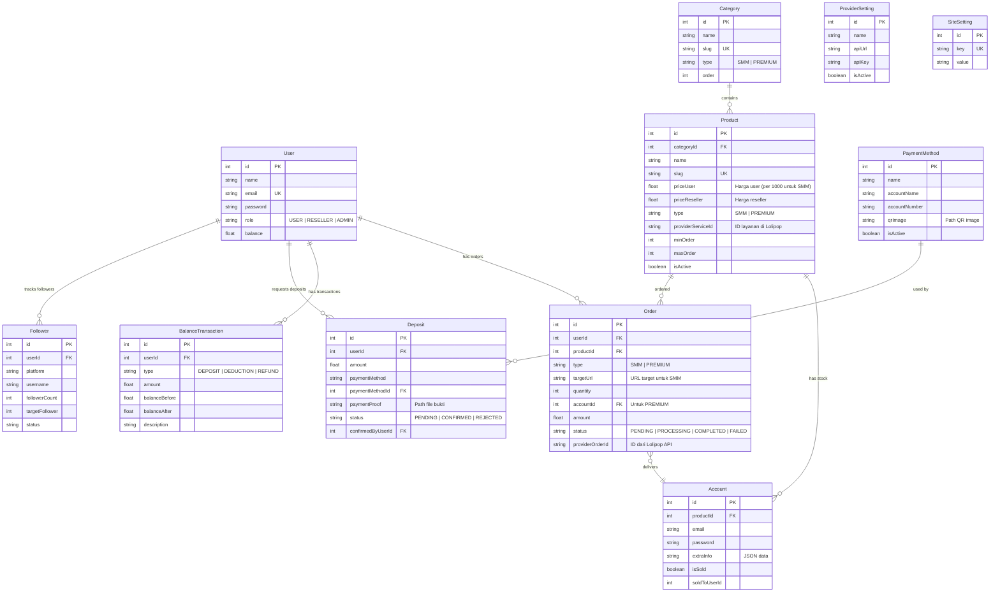
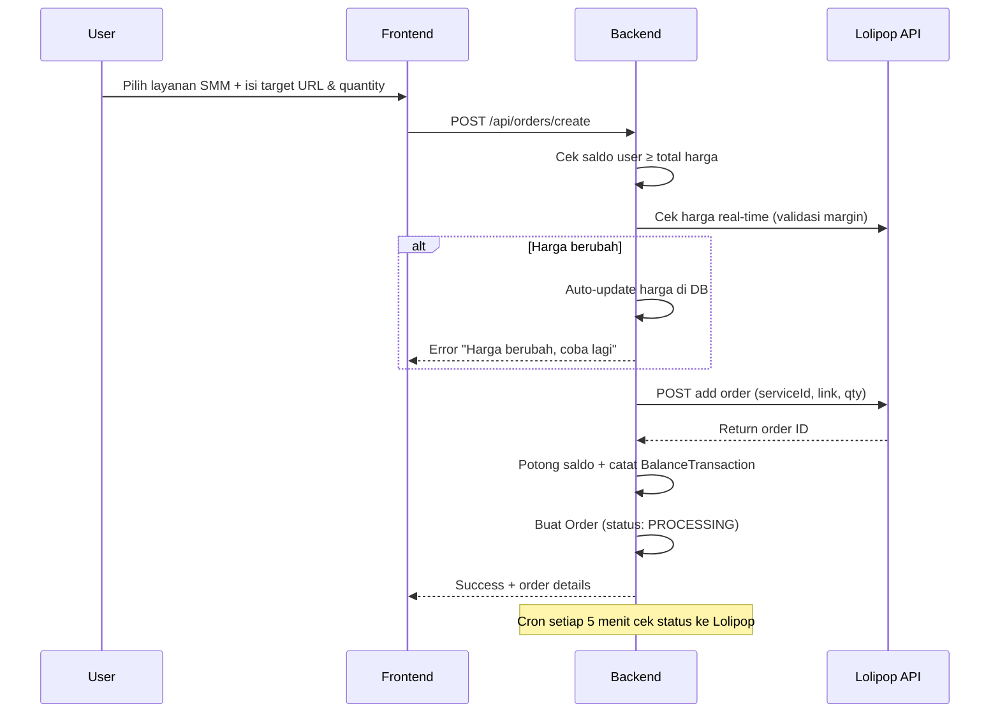
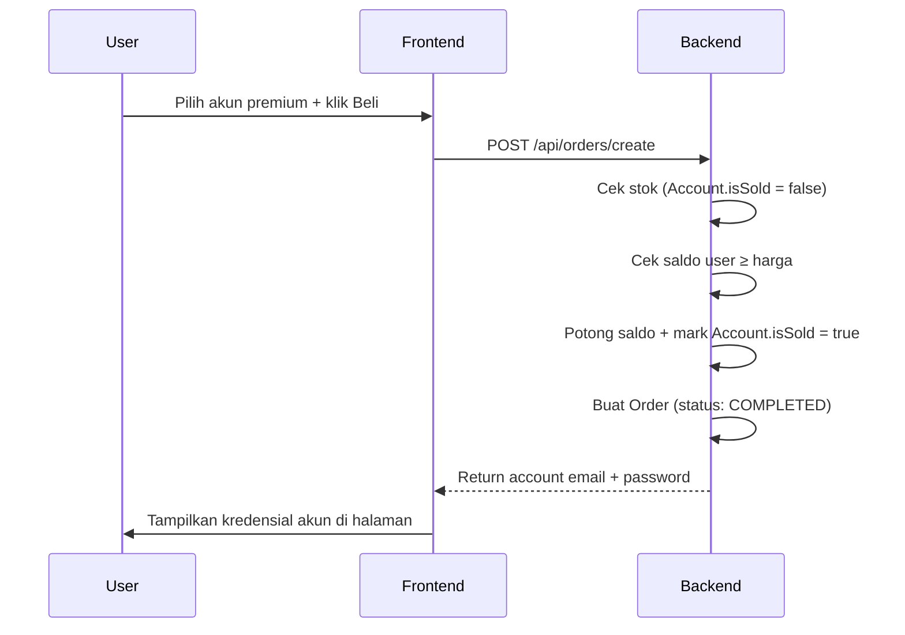
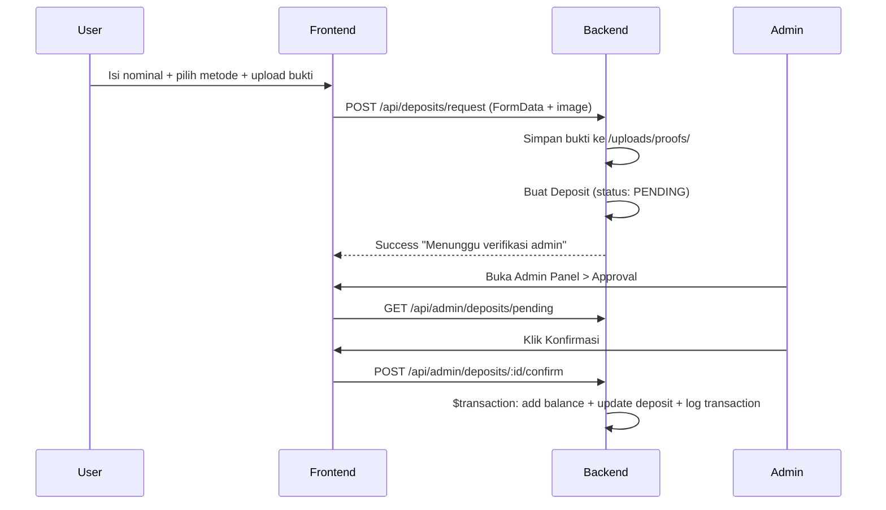

# 📋 Analisis Lengkap Website Markaz-Arshy (Follower Store)

## Gambaran Umum

**Markaz-Arshy** adalah website toko online untuk menjual layanan **Social Media Marketing (SMM)** seperti followers, likes, views, dan juga **akun premium** (Netflix, Spotify, ChatGPT, dll). Website ini dibangun dengan arsitektur **full-stack monorepo** dengan backend dan frontend terpisah.

---

## 🏗️ Arsitektur & Tech Stack

| Layer | Teknologi | Detail |
|---|---|---|
| **Frontend** | React 19 + Vite 8 | SPA dengan React Router v6 |
| **Backend** | Express.js 4 | REST API dengan ES Modules |
| **Database** | SQLite + Prisma 6 | ORM dengan file `dev.db` |
| **Auth** | JWT (jsonwebtoken) | Bearer token, 7 hari expiry |
| **Password** | bcryptjs | Hash dengan salt 10 rounds |
| **File Upload** | Multer 2 | Bukti transfer & QRIS image |
| **SMM Provider** | Lolipop SMM API | External API integration |
| **Styling** | Vanilla CSS | Dark neon glassmorphism theme |
| **Icons** | Lucide React | Modern icon library |

---

## 📂 Struktur Direktori Lengkap

```
d:\follower-store\
├── backend\
│   ├── .env                          # Environment variables (PORT, JWT, API keys)
│   ├── package.json                  # Backend dependencies
│   ├── prisma\
│   │   ├── schema.prisma             # Database schema (10 models)
│   │   ├── dev.db                    # SQLite database file
│   │   └── migrations\               # Prisma migration history
│   ├── src\
│   │   ├── index.js                  # Express server entry point (port 5000)
│   │   ├── db.js                     # PrismaClient singleton
│   │   ├── seed.js                   # Database seeder
│   │   ├── cron.js                   # Scheduled jobs (status check & catalog sync)
│   │   ├── middleware\
│   │   │   └── auth.js               # JWT auth & admin role middleware
│   │   └── routes\
│   │       ├── auth.js               # Register, Login, Profile
│   │       ├── catalog.js            # Public: categories & products
│   │       ├── orders.js             # Create order, order history
│   │       ├── deposits.js           # Deposit request, payment methods, history
│   │       ├── admin.js              # Admin CRUD (stats, products, orders, etc.)
│   │       └── admin-payment.js      # Admin payment method management
│   ├── uploads\                      # Static file storage
│   │   ├── proofs\                   # Payment proof images
│   │   └── qris\                     # QRIS payment QR images
│   ├── create_admin.js               # Utility: create admin user
│   ├── seed_payment_methods.js       # Utility: seed payment methods
│   ├── seed_vps_rdp.js               # Utility: seed VPS/RDP products
│   ├── sync_products.js              # Utility: manual product sync
│   ├── check.js, check_sync.js       # Debug/check scripts
│   └── cleanup_sync.js              # Cleanup script
│
├── frontend\
│   ├── index.html                    # HTML entry point (alert/confirm mocked)
│   ├── vite.config.js                # Vite configuration
│   ├── package.json                  # Frontend dependencies
│   ├── public\                       # Static assets
│   └── src\
│       ├── main.jsx                  # React entry (StrictMode)
│       ├── App.jsx                   # Root component (routing, auth state)
│       ├── App.css                   # Minimal app CSS
│       ├── index.css                 # Global design system (344 lines)
│       ├── assets\                   # Static assets
│       ├── pages\
│       │   ├── Home.jsx              # Landing page / Hero
│       │   ├── Login.jsx             # Login form
│       │   ├── Register.jsx          # Registration form
│       │   ├── CatalogPage.jsx       # Product catalog with sidebar filter
│       │   ├── ProductDetailPage.jsx # Product detail + checkout form
│       │   ├── Dashboard.jsx         # User dashboard (orders, deposits, topup)
│       │   ├── DepositPage.jsx       # Deposit form with image upload
│       │   └── AdminDashboard.jsx    # Admin panel with sidebar navigation
│       └── components\
│           ├── AdminOverview.jsx     # Admin stats overview
│           ├── AdminDeposits.jsx     # Pending deposit approval
│           ├── AdminProducts.jsx     # Product CRUD
│           ├── AdminCategories.jsx   # Category management
│           ├── AdminProductStock.jsx # Premium account stock upload
│           ├── AdminAllOrders.jsx    # All orders viewer
│           ├── AdminManualBalance.jsx# Manual user balance control
│           └── AdminPaymentMethods.jsx # Payment method management
│
└── docs\
    └── superpowers\                  # Documentation
```

---

## 🗄️ Database Schema (10 Models)



---

## 🔌 API Endpoints (20+ Endpoints)

### Auth Routes — `/api/auth`

| Method | Endpoint | Auth | Deskripsi |
|--------|----------|------|-----------|
| `POST` | `/register` | ❌ | Registrasi user baru (role: USER) |
| `POST` | `/login` | ❌ | Login, return JWT token (7d expiry) |
| `GET` | `/me` | ✅ | Get current user profile & balance |

### Catalog Routes — `/api/catalog`

| Method | Endpoint | Auth | Deskripsi |
|--------|----------|------|-----------|
| `GET` | `/categories` | ❌ | List semua kategori |
| `GET` | `/products` | ❌ | List produk aktif (filter: `type`, `categorySlug`) |
| `GET` | `/products/:slug` | ❌ | Detail produk by slug |

### Orders Routes — `/api/orders`

| Method | Endpoint | Auth | Deskripsi |
|--------|----------|------|-----------|
| `POST` | `/create` | ✅ | Buat order baru (SMM / Premium) |
| `GET` | `/history` | ✅ | Riwayat order user |

### Deposits Routes — `/api/deposits`

| Method | Endpoint | Auth | Deskripsi |
|--------|----------|------|-----------|
| `GET` | `/payment-methods` | ✅ | List metode pembayaran aktif |
| `POST` | `/request` | ✅ | Ajukan deposit (+ upload bukti transfer) |
| `GET` | `/history` | ✅ | Riwayat deposit user |

### Admin Routes — `/api/admin` (semua butuh ADMIN role)

| Method | Endpoint | Deskripsi |
|--------|----------|-----------|
| `GET` | `/stats` | Dashboard statistics |
| `POST` | `/categories` | Buat kategori baru |
| `DELETE` | `/categories/:id` | Hapus kategori (jika kosong) |
| `GET` | `/deposits/pending` | List deposit pending |
| `POST` | `/deposits/:id/confirm` | Konfirmasi deposit (+ add balance) |
| `POST` | `/deposits/:id/reject` | Tolak deposit |
| `POST` | `/products` | Buat produk baru |
| `PUT` | `/products/:id` | Update produk |
| `DELETE` | `/products/:id` | Soft delete (deactivate) produk |
| `GET` | `/products/:productId/accounts` | List stok akun premium |
| `POST` | `/products/:productId/accounts/bulk` | Bulk upload stok akun |
| `GET` | `/orders` | List semua pesanan |
| `POST` | `/users/:id/balance` | Manual add/subtract saldo user |

### Admin Payment Routes — `/api/admin` (lanjutan)

| Method | Endpoint | Deskripsi |
|--------|----------|-----------|
| `POST` | `/payment-methods` | Buat payment method (+ QRIS upload) |
| `PATCH` | `/payment-methods/:id/toggle` | Toggle aktif/nonaktif |

---

## 🔄 Alur Bisnis Utama

### 1. Alur Pembelian Layanan SMM



### 2. Alur Pembelian Akun Premium



### 3. Alur Deposit Saldo



---

## ⏰ Cron Jobs (Background Tasks)

Didefinisikan di [cron.js](file:///d:/follower-store/backend/src/cron.js):

| Job | Interval | Fungsi |
|-----|----------|--------|
| **Check Order Status** | Setiap 5 menit | Cek status order SMM yang `PROCESSING` ke Lolipop API. Auto-update status (COMPLETED/FAILED) dan refund saldo jika canceled/refunded |
| **Sync Catalog** | Setiap 12 jam | Sinkronisasi katalog layanan dari Lolipop API. Auto-create categories & products, update harga (markup 20% user / 10% reseller), deactivate produk yang sudah tidak ada |

---

## 🔐 Sistem Autentikasi

- **Registrasi**: Hash password dengan bcrypt (salt 10), role default `USER`, balance 0
- **Login**: JWT token (7 hari), payload: `{ id, email, role }`
- **Middleware**: 2 level — `requireAuth` (cek JWT valid) → `requireAdmin` (cek role ADMIN)
- **State Frontend**: Token & user disimpan di `localStorage`, di-load ulang saat refresh

> [!WARNING]
> JWT Secret di `.env` hardcoded: `"rahasia_jwt_markaz_arshy_2026_super_aman"` — harus diganti untuk production!

---

## 🎨 Design System (Frontend)

Tema: **Dark Neon Glassmorphism**

- **Font**: Plus Jakarta Sans (body) + Outfit (heading) dari Google Fonts
- **Background**: `#070913` dengan radial gradient overlay
- **Primary Color**: `#00f2fe` (cyan neon) dengan gradient ke `#4facfe`
- **Accent**: `#7f00ff` → `#ff007f` gradient
- **Glassmorphism**: `backdrop-filter: blur(16px)` + semi-transparent backgrounds
- **Neon Effects**: Box shadows dengan `rgba(0, 242, 254, 0.15)` glow
- **Responsive**: Breakpoints di 768px, 900px, 1200px

---

## 🗺️ Routing Frontend

| Path | Component | Auth | Deskripsi |
|------|-----------|------|-----------|
| `/` | `Home` | ❌ | Landing page dengan hero + features |
| `/catalog/smm` | `CatalogPage` | ❌ | Katalog layanan SMM |
| `/catalog/premium` | `CatalogPage` | ❌ | Katalog akun premium |
| `/catalog/vps-rdp` | `CatalogPage` | ❌ | Katalog VPS/RDP |
| `/product/:slug` | `ProductDetailPage` | ❌ (login untuk beli) | Detail produk + form checkout |
| `/login` | `Login` | ❌ | Form login |
| `/register` | `Register` | ❌ | Form registrasi |
| `/dashboard/*` | `Dashboard` | ✅ | User dashboard (orders, deposits, topup) |
| `/admin/*` | `AdminDashboard` | ✅ (ADMIN) | Panel admin dengan 8 sub-halaman |

### Sub-routes Admin (`/admin/...`):
- `/` → Overview (statistik)
- `/deposits` → Approval deposit
- `/products` → Kelola produk
- `/categories` → Kelola kategori
- `/stock` → Upload stok akun premium
- `/orders` → Lihat semua pesanan
- `/balance` → Kontrol saldo manual
- `/payment-methods` → Kelola metode pembayaran

---

## 👥 Role & Hak Akses

| Role | Harga | Akses |
|------|-------|-------|
| **USER** | `priceUser` (markup 20%) | Dashboard, beli produk, deposit |
| **RESELLER** | `priceReseller` (markup 10%) | Sama seperti User + harga diskon |
| **ADMIN** | — | Full akses admin panel + semua fitur user |

---

## 🧩 Fitur-Fitur Utama

### ✅ Yang Sudah Implementasi
1. **Registrasi & Login** — JWT-based auth
2. **Katalog Produk** — Dengan filter sidebar & search
3. **Pembelian SMM** — Integrasi Lolipop API + validasi harga real-time
4. **Pembelian Akun Premium** — Auto-deliver email/password
5. **Deposit Saldo** — Upload bukti transfer + admin approval
6. **Admin Panel Lengkap** — Stats, CRUD produk/kategori, approval deposit, stok management
7. **Cron Job** — Auto-sync katalog & cek status order
8. **Payment Method** — QRIS image upload support
9. **Balance Ledger** — Pencatatan setiap mutasi saldo
10. **Responsive Design** — Dark neon glassmorphism theme

### ⚠️ Catatan Teknis
- Database menggunakan **SQLite** (cocok untuk development, perlu migrasi ke PostgreSQL untuk production)
- Frontend hardcode API URL ke `http://localhost:5000` (perlu env variable untuk production)
- `window.alert` dan `window.confirm` di-mock di `index.html` (untuk development/testing)
- File upload disimpan lokal di folder `uploads/` (perlu cloud storage untuk production)
- Harga SMM di DB adalah **per 1000 unit**, dihitung proporsional saat checkout

---

## 📊 Seed Data (Testing)

| User | Email | Password | Role | Saldo |
|------|-------|----------|------|-------|
| Admin | `admin@followerstore.com` | `admin123` | ADMIN | Rp 1.000.000 |
| Reseller | `reseller@followerstore.com` | `reseller123` | RESELLER | Rp 500.000 |
| User Biasa | `user@followerstore.com` | `user123` | USER | Rp 100.000 |
